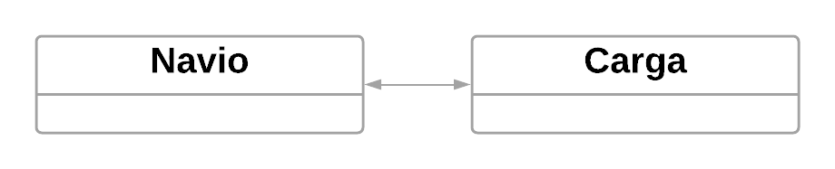
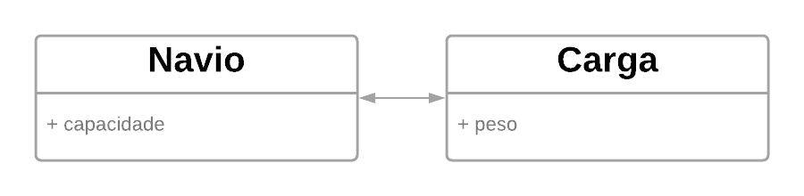
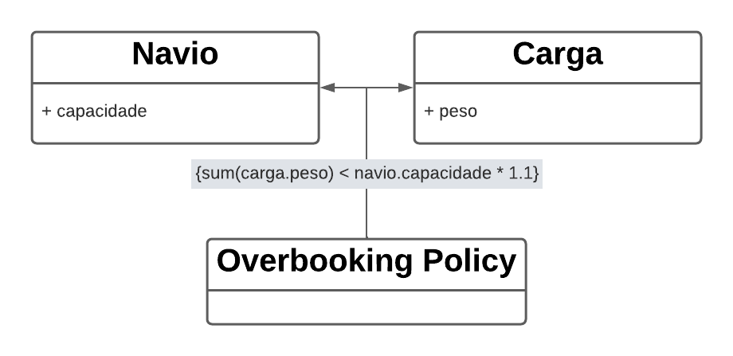

## 1. Design Orientado ao Conhecimento

Construir um modelo que reflita o conhecimento adquirido junto aos experts de domínio vai muito além de fazer dinâmicas como *listar os substantivos*, como aprendemos tradicionalmente. As atividades do dia-a-dia e regras implícitas são pontos centrais no modelo de domínio que estamos construíndo, já que as entidades evoluem à medida que nosso conhecimento sobre o negócio também evolui. A atividade que chamamos de *triturar* conhecimento instiga que surjam novos modelos que reflitam esse novo conhecimento adquirido. Em paralelo, à medida que os modelos mudam, os desenvolvedores refatoram sua implementação para que ela expresse a intenção por trás do modelo, dando utilidade ao código escrito.

Após a fase onde as entidades do sistema e os valores que elas podem assumir são compreendidos, o triturar do conhecimento pode se tornar um pouco desconfortável, porque muitas vezes ele mostra como há inconsistências reais nas regras de negócio.
Os experts de domínio, em seu dia-a-dia, não percebem o quão complexos seus processos mentais podem ser, à medida que eles navegam em meio a regras, relevam contradições, e preenchem as incertezas com senso comum. Software não tem essa capacidade. É através do *triturar do conhecimento*, em parceria direta com os experts de domínio que as regras são esclarecidas, reveladas, combinadas ou até retiradas de escopo.

#### Exemplo

##### Extraindo um conceito escondido.

Vamos começar com um exemplo simples de um modelo que pode servir como base para uma aplicação que realiza *booking* de cargas em um navio.




Podemos afirmar que a aplicação tem responsabilidade de associar cada **Carga** a um **Navio**, e gravar as interações dessa relação. Até aqui tudo bem. Um código possível seria esse:

```python
def fazerReserva(carga, navio):
    confirmacao = fila_de_confirmacoes.pop()
    navio.addReserva(carga, confirmacao)
    return confirmacao

carga = Carga()
navio = Navio()
reserva = fazerReserva(carga, navio)
```

Mas agora vem algo que você - que mora bem longe do litoral - provavelmente não sabe: pelo fato de sempre haver cancelamento por parte dos clientes de última hora se tornou padrão na indústria reservar uma quantidade maior de cargas em um navio do que ele de fato suporta. Essa prática é chamada de "**overbooking**". Às vezes é usado apenas uma porcentagem para calcular o tal overbooking; às vezes podem ser regras complexas que favorecem um cliente ao invés de outro, ou então alguns tipos de carga.

Essa é uma estratégia comum entre as pessoas que trabalham na indústria de cargas, porém pode não ser facilmente entendido por todas os desenvolvedores do time.

Então um belo dia você recebe o tal requisito a ser implementado no sistema, com a seguinte descrição:

- Permitir 110% de overbooking.

Vamos então deixar o diagrama assim, pra contemplar essa nova demanda:




E mudamos nosso código pra que fique assim:

```python
def fazerReserva(carga, navio):
    capacidade_maxima = navio.capacidade * 1.1
    if navio.get_soma_total_das_cargas() + carga.peso > capacidade_maxima:
        return False
    else:
        confirmacao = fila_de_confirmacoes.pop()
        navio.addReserva(carga, confirmacao)
        return confirmacao

carga = Carga()
navio = Navio()
reserva = fazerReserva(carga, navio)
```

Agora atenção: estamos escrevendo de um modo obscuro algo que é claramente uma regra de negócio **muito importante**.
Da maneira como está escrito acima vai ser muito difícil algum expert de domínio entender exatamente o pensamento por trás disso, mesmo com a ajuda de um desenvolvedor. Imagine se a regra fosse ainda mais complexa, o pesadelo que seria fazer com que essa regra agora apenas se aplicasse a navios de certo tipo de casco, ou para cargas que estão em certas baias.

O que precisamos fazer é capturar a essência do conhecimento que está por trás dessa regra de negócio. O que estamos tratando aqui, **overbooking**, claramente trata-se de uma **Policy** (política, como em "política de incentivo a x, y e z").                                          



```python
overbookingPolicy = OverbookingPolicy()

def fazerReserva(carga, navio):
    if not overbookingPolicy.respeita_limite_maximo(carga, navio):
        return False
    else:
        confirmacao = fila_de_confirmacoes.pop()
        navio.addReserva(carga, confirmacao)
        return confirmacao

carga = Carga()
navio = Navio()
reserva = fazerReserva(carga, navio)
```

A nova classe OverbookingPolicy agora contém o seguinte método:

```python
class OverbookingPolicy:
    def respeita_limite_maximo(self, carga, navio):
        return carga.peso + navio.get_soma_total_das_cargas() <= navio.capacidade * 1.1
```

Desse modo, vai ficar claro para todo mundo que *overbooking* é uma política distinta, e a regra dessa política está explícita e separada.

Claro, isso não significa que você deve aplicar tal design para **todas** as implementações, iremos ver futuramente como julgar quais os momentos mais adequados para tal. Porém, esse design explícito traz diversas vantagens.

Pra que seja modelado dessa forma elaborada, os programadores e todos os envolvidos devem chegar a um consenso sobre o que é a natureza de um overbooking e como tal política é importante para o negócio, não apenas um cálculo obscuro.

Os programadores devem mostrar tais artefatos acima, talvez até mesmo a modelagem da classe se os experts de domínio se mostrarem interessados, e esses modelos devem ser compreensíveis (com auxílio dos desenvolvedores) àqueles que fazem parte do domínio, assim firmando um ciclo virtuoso de **feedback** entre os envolvidos.

## 2. Isolando o domínio

As classes descritas nos exemplos acima expressam o **domínio** do software, ou seja, expressam o conhecimento que desejamos extrair dos experts de domínio e transformar em modelo, que logo em seguida terá também sua representacão em código: nosso produto final.

Porém uma aplicação é composta de muitas partes. Para que um usuário escolha uma cidade de destino para uma carga dentre uma lista de diversas cidades é preciso de um programa que faça as seguintes tarefas: 
  1. Desenhe um ícone de seleção na tela
  2. Busque no banco de dados quais são todas as cidades possíveis
  3. Interprete a cidade que o usuário selecionou na tela
  4. Associe a cidade a uma carga, e 
  5. Faça com que as alterações sejam gravadas no banco de dados.

Atualmente, devido à popularização de frameworks e microserviços, um programador com alguns poucos meses de experiência é exposto desde cedo à ideia de que há uma separação clara entre dois universos: o que é desenhado na tela e a lógica da aplicação/persistência dos dados - popularmente conhecido como front-end e back-end. Essa ideia é relativamente nova para aplicações de pequeno-médio porte, especialmente quando olhamos para linguagens de programação que oferecem nativamente (ou com extensões oficiais) um grande ambiente com todas as peças disponíveis: componentes de tela como tabelas, grids e botões, componentes que acessam banco de dados, componentes que tratam requests web, etc. Em uma linguagem com essa capacidade é tentador misturar todos esses componenetes pois afinal esse é o modo mais simples de fazer a aplicação rodar no curto prazo.

// Colocar aqui um exemplo de mistura de lógica front-end com back-end.

Surge portanto a ideia de uma **arquitetura em camadas**, onde haverá no mínimo um arquivo ou classe responsável por cada camada. Essa especialização permite um design mais coeso de cada aspecto, além de tornar mais simples a leitura do código, pois está definido exatamente qual a responsabilidade da classe/arquivo. Experiência e convenção devem ditar as regras aqui, para que não exageremos na divisão de responsabilidade ou a ignoremos por completo.

Convencionou-se que as camadas são as seguintes, com pequenas variações:
   1. Camada da **Interface gráfica** (ou de **Apresentação**)
      - Responsável por mostrar as informações ao usuário e interpretar os comandos do usuário. Um usuário pode ser uma pessoa interagindo com uma tela, mas também um sistema externo. Enquanto um usuário pode ter a capacidade de clicar em um botão para adicionar uma carga a um navio, um sistema externo pode ter a capacidade de enviar uma requisição para adicionar uma carga a um navio. A maneira como isso é mostrado ao usuário muda, mas a ideia permanece: um ator externo pede, clica, solicita, requisita.
   2. Camada da **Aplicação**
      - Define qual exatamente é a tarefa que o software precisa realizar e solicita com detalhes ao domínio quais são os parâmetros que ele deve usar para cumprir o pedido. Essa camada geralmente é mantida fina, com pouco código, afinal ela não tem lógica de negócios. Ela também não tem estado, ou seja, ela não sabe decidir se uma operação vai ser concluída ou não, porém ela pode guardar o estado que vem da camada de domínio para que a camada de interface gráfica mostre uma barra de progresso para o usuário, por exemplo.
   3. Camada do **Domínio**
      - Responsável por representar os conceitos do negócio, informações sobre o negócio, e regras de negócio. Quer saber qual a lotação do navio de carga no momento? Essa informação é mantida aqui! É a camada de domínio que será consultada a fim de saber se o navio está cheio, vazio, perto da capacidade máxima etc. ***Essa camada é o coração do software.*** Entretanto, os detalhes técnicos de onde está armazenado esse dado será responsabilidade da camada de Infraestrutura.
   4. Camada da **Infraestrutura**
        - Provê os detalhes técnicos e de certo modo genéricos que suportam as camadas acima: a mensagem que será enviada à aplicação, a persistência dos dados que o domínio usa e assim por diante. Essa camada de infraestrutura também pode oferecer suporte às interações entre todas as camadas através de um framework arquitetural. Exemplo: frameworks atuais que acessam banco de dados de maneira simples, fornecem componentes de tela padronizados, etc.